# Configure your GitHub Copilot Extension

Follow the steps below to configure the Copilot Extension template for your own personal use.

## Expose Your Extension

To test your Copilot extension, you need to make it publicly accessible:

1. If using Visual Studio Code (VS Code), enable [port forwarding](https://code.visualstudio.com/docs/editor/port-forwarding). Note that the port is private by default - a good thing - but for this use case you need to set it to public.

Alternatively, use tools like [cloudflared](https://developers.cloudflare.com/cloudflare-one/connections/connect-networks/get-started/create-local-tunnel/) or [ngrok](https://ngrok.com/) to expose a public URL.

The application is set up to run on port 3000, so we'll forward port 3000.

It's worth mentioning that this setup is great for testing, but once you're ready to make your extension public you'll need to deploy the web app (which acts as the GitHub app) to a publicly accessible location.

## Create a GitHub app

Head to your settings page on GitHub, and at the bottom, to the left, click on the **Developer Settings** link. This will bring you to your **GitHub apps**. (You can also directly navigate to your **GitHub apps** page at https://github.com/settings/apps. Configure the following:

### General Settings

1. Enter a **GitHub App name**, e.g. my-copilot-extension
2. Enter a URL for the homepage. This can be the same as the test URL for now.
3. Set the **Callback URL** (currently required). This can also be the same as the test URL for now. Even if you're not using OAuth, you still need to put a URL here. In the future this may no longer be required.

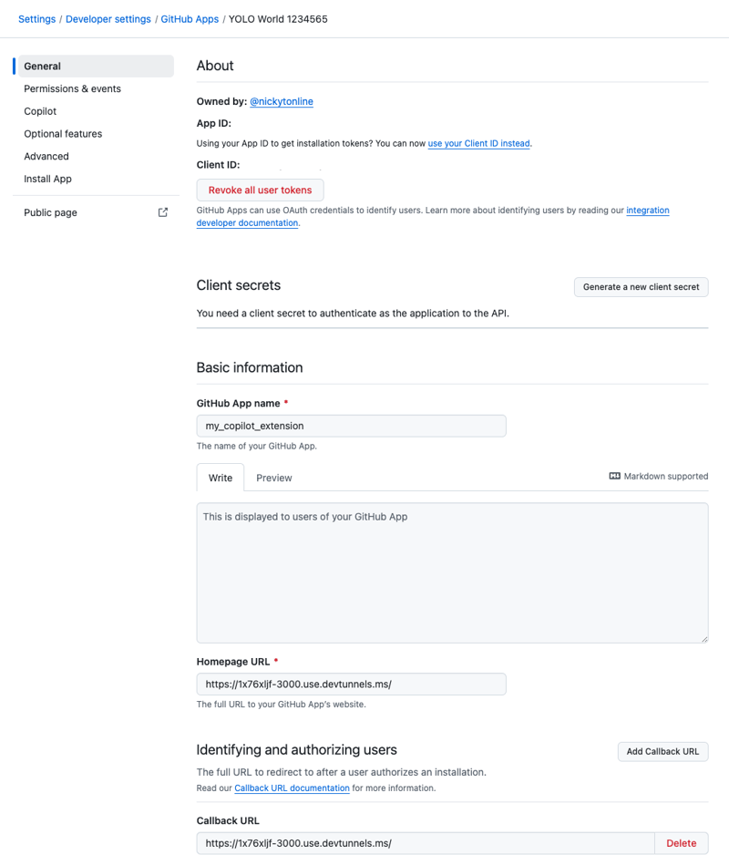

4. Disable webhooks if they're enabled.

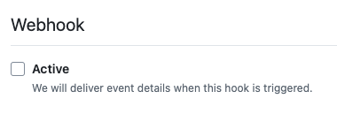

5. Make sure the app is initially accessible only to you. Later, when you're ready to make your GitHub Copilot extension publicly available, you can enable it for everyone.

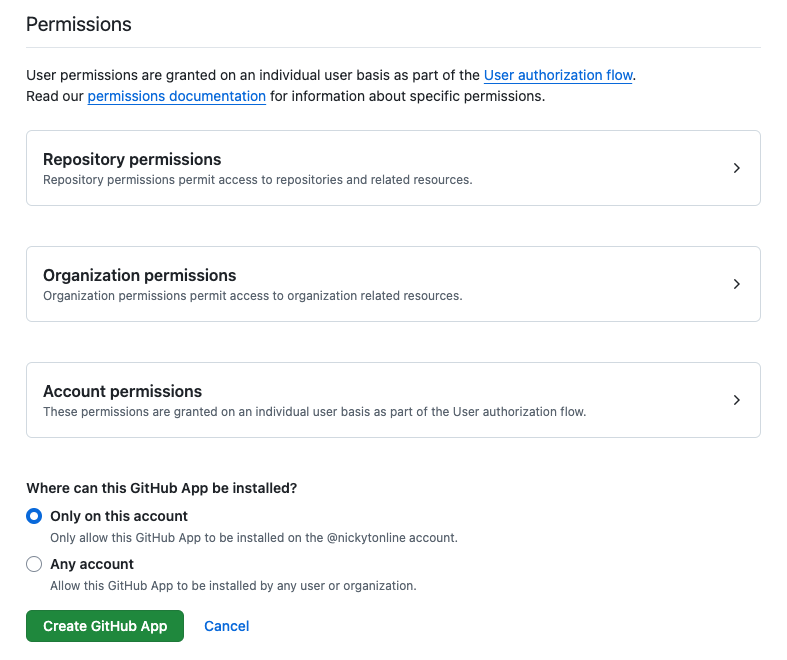

6. Click the **Create GitHub App** button to create the GitHub app.

### Permissions & Events Settings

Next, you need to configure permissions. You only need to provide the bare minimum permissions for a Copilot extension to work.

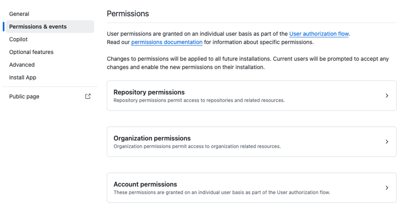

1. Expand the **Account permissions** section and set the Copilot Chat permission to *Read-only*. The default is *No access*.

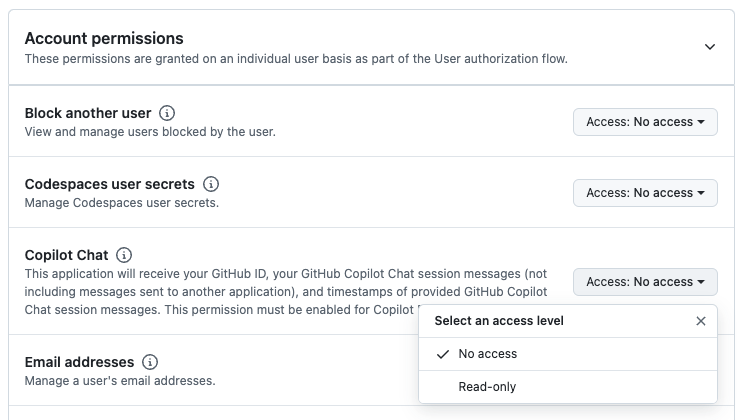

2. Click **Save changes**. Don't be alarmed by the *Are you sure you want to update permissions?* message.

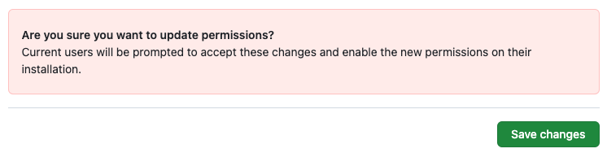

### Copilot Settings

1. Set the **App Type** to *Agent*. It's set to *Disabled* by default.
2. Set the URL to the root of the public URL you exposed via tunneling/port forwarding.

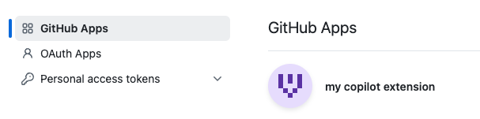

3. Click **Save**.

Congratulations! You've configured your first Copilot extension!

## Install Your Copilot Extension

Before you can use the extension, it has to be installed.

1. Navigate to your **[GitHub apps]kv(https://github.com/settings/apps)** in your developer settings.

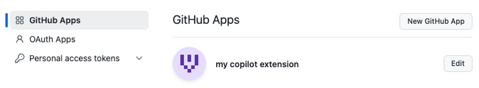

2. Click the **Edit** button to edit the app.

3. Go to the **Install App** section of the GitHub Apps' settings.

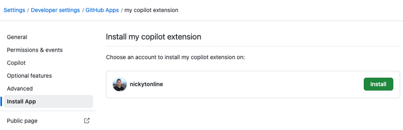

4. Click the **Install** button to install the application.

You're brought to an intermediary page to confirm the installation of the GitHub app. Click the **Install** button.

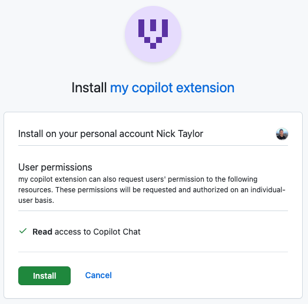

Your Copilot extension is installed for your GitHub account.

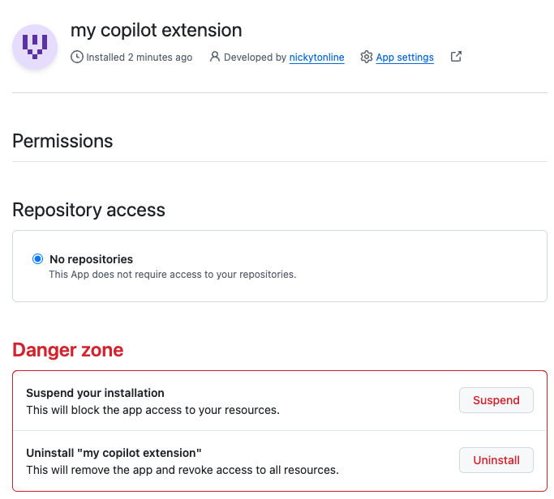

## Test Your Copilot Extension

You can test your Copilot extension in a few environments:

1. GitHub's Copilot chat
2. [VS Code's Copilot Chat](https://marketplace.visualstudio.com/items?itemName=VisualStudioExptTeam.VSGitHubCopilot)
3. [Visual Studio's Copilot Chat](https://learn.microsoft.com/en-us/visualstudio/ide/visual-studio-github-copilot-chat?view=vs-2022)

For these environments, follow these steps:

1. In the GitHub Copilot chat, type "@" to see available extensions.

2. Your extension should appear as, e.g. "@my-copilot-extension".

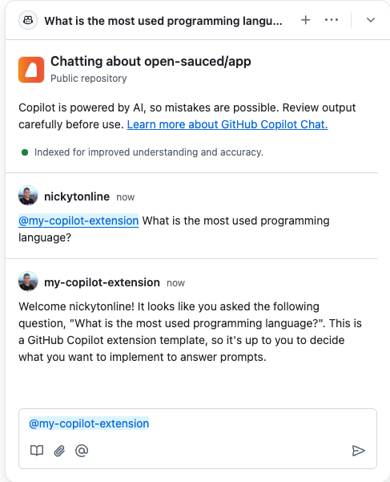

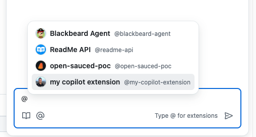

3. Select your extension and ask a question or perform an operation.

4. The Copilot extension will return a response of "Welcome *your_github_username*! It looks like you asked the following question: *your_question*. This is a GitHub Copilot extension template, so it's up to you to decide what you want to implement to answer prompts."

It won't respond to your specific question, as that functionality has not been implemented. This is where you can explore the preview SDK or integrate with a third-party service to provide more meaningful responses.
